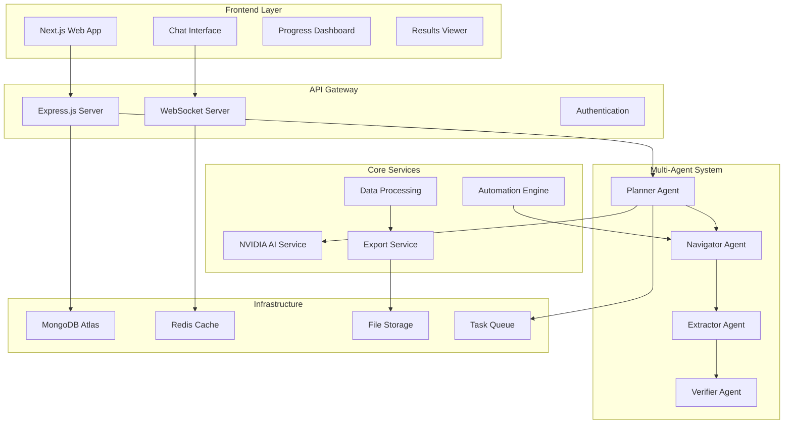
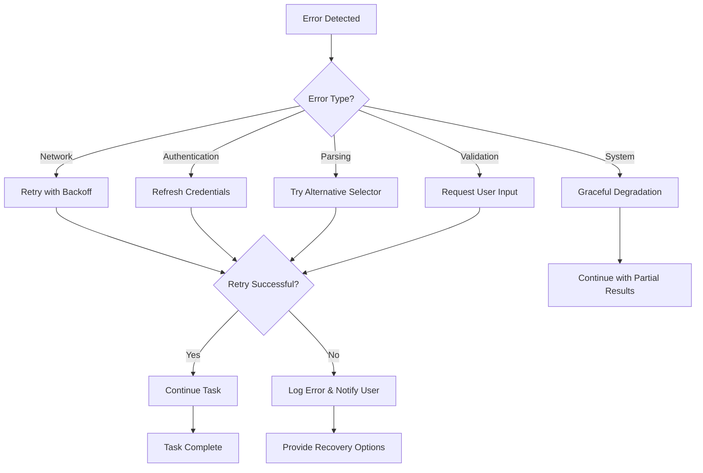

# Design Document

## Overview

The Browser AI Agent is a cloud-enabled, multi-agent platform that performs autonomous web automation tasks. The system uses a microservices architecture with specialized AI agents, real-time communication, and robust data processing capabilities to deliver faster and more reliable automation than existing solutions.

## Architecture

### High-Level Architecture



### Multi-Agent Architecture

The system employs four specialized AI agents that work collaboratively:

1. **Planner Agent**: Interprets user commands and creates execution plans
2. **Navigator Agent**: Handles web navigation and browser interactions
3. **Extractor Agent**: Extracts and structures data from web pages
4. **Verifier Agent**: Validates results and handles error recovery

## Components and Interfaces

### Frontend Components

#### 1. Landing Page
- **Purpose**: Welcome users and provide quick-start options
- **Features**: 
  - Hero section with value proposition
  - 2-5 suggested quick-start tasks
  - Demo video or interactive tour
  - Sign-up/login forms

#### 2. Chat Interface
- **Purpose**: Natural language command input and conversation
- **Features**:
  - Message history with context preservation
  - Command suggestions and auto-complete
  - File upload for resumes/documents
  - Voice input support (Phase 2)

#### 3. Live Progress Dashboard
- **Purpose**: Real-time task monitoring and control
- **Features**:
  - Step-by-step progress visualization
  - Agent activity indicators
  - Pause/resume/cancel controls
  - Error notifications and recovery options

#### 4. Results Viewer
- **Purpose**: Display and export task results
- **Features**:
  - Structured data tables
  - Visual charts and graphs
  - Export buttons (PDF, Word, Excel, JSON)
  - Sharing and collaboration tools

### Backend Services

#### 1. NVIDIA AI Integration Service
- **Purpose**: Natural language processing and task planning
- **Components**:
  - Intent Classification
  - Task Decomposition
  - Context Management
  - Response Generation

#### 2. Automation Engine
- **Purpose**: Web browser automation and control
- **Components**:
  - Browser Manager (Playwright/Puppeteer)
  - Element Selector
  - Action Executor
  - Screenshot Capture
  - Proxy Rotation

#### 3. Data Processing Service
- **Purpose**: Extract, transform, and structure web data
- **Components**:
  - Content Parser
  - Data Validator
  - Schema Mapper
  - Quality Checker

#### 4. Export Service
- **Purpose**: Generate reports in multiple formats
- **Components**:
  - PDF Generator
  - Word Document Creator
  - Excel Spreadsheet Builder
  - Chart/Graph Generator

## Data Models

### Core Entities

#### User
```typescript
interface User {
  id: string;
  email: string;
  name: string;
  profile: UserProfile;
  credentials: EncryptedCredentials;
  preferences: UserPreferences;
  createdAt: Date;
  updatedAt: Date;
}

interface UserProfile {
  fullName: string;
  phone?: string;
  linkedinUrl?: string;
  resumeUrl?: string;
  coverLetterTemplate?: string;
  jobPreferences?: JobPreferences;
}
```

#### Task
```typescript
interface Task {
  id: string;
  userId: string;
  type: TaskType;
  status: TaskStatus;
  command: string;
  plan: ExecutionPlan;
  progress: TaskProgress;
  results: TaskResults;
  createdAt: Date;
  updatedAt: Date;
}

enum TaskType {
  JOB_SEARCH = 'job_search',
  COMPANY_RESEARCH = 'company_research',
  CONTACT_SCRAPING = 'contact_scraping',
  DATA_EXTRACTION = 'data_extraction',
  CUSTOM_WORKFLOW = 'custom_workflow'
}

enum TaskStatus {
  PENDING = 'pending',
  RUNNING = 'running',
  PAUSED = 'paused',
  COMPLETED = 'completed',
  FAILED = 'failed',
  CANCELLED = 'cancelled'
}
```

#### Agent Session
```typescript
interface AgentSession {
  id: string;
  taskId: string;
  agentType: AgentType;
  status: AgentStatus;
  currentStep: string;
  context: AgentContext;
  metrics: AgentMetrics;
  createdAt: Date;
  updatedAt: Date;
}

enum AgentType {
  PLANNER = 'planner',
  NAVIGATOR = 'navigator',
  EXTRACTOR = 'extractor',
  VERIFIER = 'verifier'
}
```

#### Workflow Template
```typescript
interface WorkflowTemplate {
  id: string;
  name: string;
  description: string;
  userId: string;
  isPublic: boolean;
  steps: WorkflowStep[];
  parameters: WorkflowParameter[];
  tags: string[];
  usageCount: number;
  rating: number;
  createdAt: Date;
  updatedAt: Date;
}
```

## Error Handling

### Error Categories

1. **Network Errors**: Connection timeouts, DNS failures, proxy issues
2. **Authentication Errors**: Invalid credentials, expired tokens, rate limiting
3. **Parsing Errors**: Malformed HTML, missing elements, structure changes
4. **Validation Errors**: Invalid data formats, missing required fields
5. **System Errors**: Memory issues, disk space, service unavailability

### Error Recovery Strategies

1. **Automatic Retry**: Exponential backoff for transient failures
2. **Fallback Methods**: Alternative selectors, different data sources
3. **User Intervention**: Prompt for manual input when automation fails
4. **Graceful Degradation**: Continue with partial results when possible
5. **Error Reporting**: Detailed logs for debugging and improvement

### Error Handling Flow



## Testing Strategy

### Unit Testing
- **Coverage Target**: 90%+ code coverage
- **Focus Areas**: Core business logic, data transformations, validation
- **Tools**: Jest, Mocha, Chai
- **Mocking**: External APIs, browser automation, database operations

### Integration Testing
- **API Testing**: All REST endpoints and WebSocket connections
- **Database Testing**: CRUD operations, data integrity, migrations
- **Service Integration**: Inter-service communication, message queues
- **Tools**: Supertest, Testcontainers, Docker Compose

### End-to-End Testing
- **User Workflows**: Complete task execution from command to results
- **Browser Automation**: Real website interactions, form submissions
- **Multi-Agent Coordination**: Agent handoffs, error recovery
- **Tools**: Playwright Test, Cypress, Puppeteer

### Performance Testing
- **Load Testing**: 100+ concurrent users, sustained traffic
- **Stress Testing**: Peak load scenarios, resource exhaustion
- **Scalability Testing**: Auto-scaling behavior, resource allocation
- **Tools**: Artillery, K6, JMeter

### Security Testing
- **Authentication**: JWT validation, session management
- **Authorization**: Role-based access, data isolation
- **Data Protection**: Encryption, secure transmission
- **Vulnerability Scanning**: OWASP Top 10, dependency audits
- **Tools**: OWASP ZAP, Snyk, npm audit

## Deployment Architecture

### Cloud Infrastructure

#### Production Environment
- **Frontend**: Vercel (Next.js deployment)
- **Backend**: AWS ECS or Google Cloud Run
- **Database**: MongoDB Atlas (Multi-region)
- **Cache**: Redis Cloud
- **File Storage**: AWS S3 or Google Cloud Storage
- **CDN**: CloudFlare
- **Monitoring**: DataDog, New Relic

#### Development Environment
- **Local Development**: Docker Compose
- **Staging**: Kubernetes cluster
- **CI/CD**: GitHub Actions
- **Testing**: Automated test suites

### Scalability Considerations

1. **Horizontal Scaling**: Stateless services, load balancers
2. **Database Sharding**: User-based partitioning
3. **Caching Strategy**: Multi-level caching (Redis, CDN)
4. **Queue Management**: Task distribution, priority queues
5. **Resource Optimization**: Auto-scaling, resource limits

### Security Measures

1. **Data Encryption**: AES-256 at rest, TLS 1.3 in transit
2. **Access Control**: JWT tokens, role-based permissions
3. **Network Security**: VPC, firewalls, DDoS protection
4. **Audit Logging**: Comprehensive activity logs
5. **Compliance**: GDPR, CCPA data protection standards

## Performance Requirements

### Response Times
- **UI Interactions**: < 1 second
- **API Responses**: < 2 seconds
- **Task Initiation**: < 5 seconds
- **Data Export**: < 30 seconds

### Throughput
- **Concurrent Users**: 100+ simultaneous sessions
- **Page Processing**: 20-100+ pages per task
- **Data Extraction**: 1000+ records per minute
- **Export Generation**: 10+ reports per minute

### Availability
- **Uptime Target**: 99.9% availability
- **Recovery Time**: < 5 minutes for critical failures
- **Backup Strategy**: Automated daily backups
- **Disaster Recovery**: Multi-region failover

## Integration Points

### External APIs
- **NVIDIA NIM API**: AI processing and natural language understanding
- **Google Sheets API**: Data synchronization and export
- **Notion API**: Database integration and content management
- **LinkedIn API**: Professional network integration
- **Email Services**: SMTP integration for notifications

### Third-Party Services
- **Payment Processing**: Stripe for subscription management
- **Analytics**: Google Analytics, Mixpanel for usage tracking
- **Error Monitoring**: Sentry for error tracking and alerting
- **Communication**: Slack/Discord webhooks for notifications

### Webhook Support
- **Task Completion**: Notify external systems when tasks finish
- **Data Updates**: Real-time data synchronization
- **Error Alerts**: Immediate notification of critical failures
- **Custom Integrations**: User-defined webhook endpoints